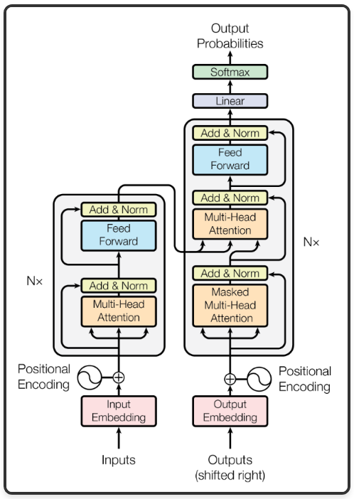
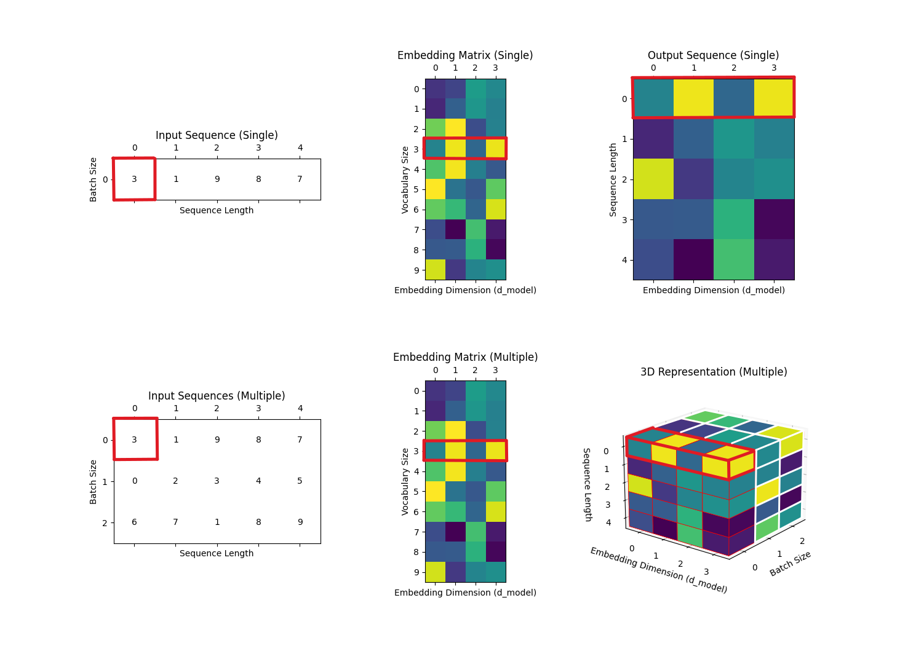
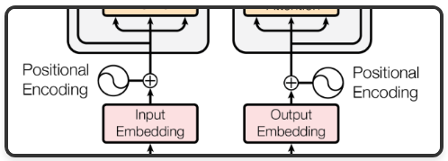
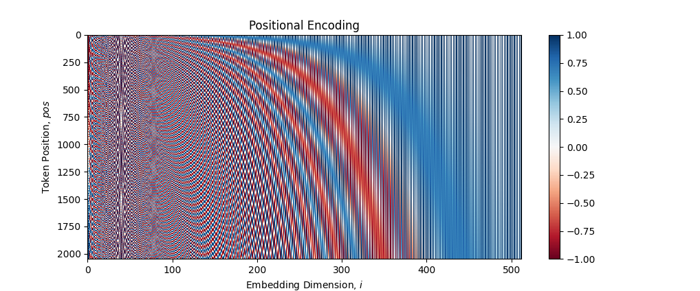
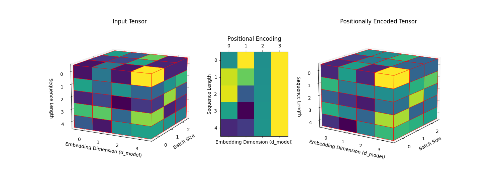
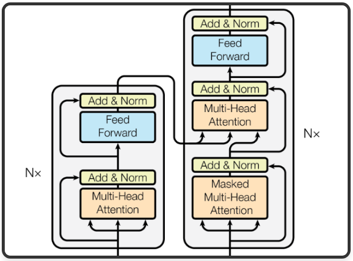

# The Transformer Architecture

The following is an overview of each of the subcomponents of the Transformer architecture as presented in the paper ["Attention Is All You Need" by Vaswani et al. (2017)](https://arxiv.org/abs/1706.03762).

I have for the most part attempted to adhere to the originally presented architecture as closely as possible and any modifications I have made are not fundamental to the architecture.

This document is broken into the following sections:

1. [Data preparation](#data-preparation)

    * [Dataset](#dataset)
    * [Tokenizing the dataset](#tokenizing-the-dataset)
    * [Preparing a data pipeline](#preparing-a-data-pipeline)

2. [Transformer Architecture](#transformer-architecture)

    * [Overview](#overview) 
    * [Input and Output Embeddings](#input-and-output-embeddings)
    * [Positional Encodings](#positional-encodings)
    * [Encoder and Decoder Stacks](#encoder-and-decoder-stacks)
      * [Multi-Head Self-Attention (MHSA)](#multi-head-self-attention-(MHSA))
      * [Masked Multi-Head Self-Attention](#masked-multi-head-self-attention)
      * [Cross Multi-Head Attention](cross-multi-head-attention)
      * [Feed Forward Layer](#feed-forward-layer)
      * [Residual Connection and Layer Normalization](#residual-connection-and-layer-normalization)

3. [Training process](#training-process)


## Data Preparation


### Dataset

The original paper used the [WMT 2014 English-German dataset](https://www.tensorflow.org/datasets/catalog/wmt14_translate). This dataset is fairly large at 2.89 GiB so instead I have opted to used a smaller dataset provided by [TensorFlow Datasets](https://www.tensorflow.org/datasets).

The [ted_hrlr_translate/pt_to_en](https://www.tensorflow.org/datasets/catalog/ted_hrlr_translate#ted_hrlr_translatept_to_en) is a 10.89 MiB dataset of Portuguese to English string translations split into  54,781 train, 1,803 test, and 1,193 validation examples derived from TED talk transcripts.

<table>
  <thead>
    <tr>
      <th class="blank level0" >&nbsp;</th>
      <th id="T_ae31d_level0_col0" class="col_heading level0 col0" >en</th>
      <th id="T_ae31d_level0_col1" class="col_heading level0 col1" >pt</th>
    </tr>
  </thead>
  <tbody>
    <tr>
      <th id="T_ae31d_level0_row0" class="row_heading level0 row0" >0</th>
      <td id="T_ae31d_row0_col0" class="data row0 col0" >and when you improve searchability , you actually take away the one advantage of print , which is serendipity .</td>
      <td id="T_ae31d_row0_col1" class="data row0 col1" >e quando melhoramos a procura , tiramos a única vantagem da impressão , que é a serendipidade .</td>
    </tr>
    <tr>
      <th id="T_ae31d_level0_row1" class="row_heading level0 row1" >1</th>
      <td id="T_ae31d_row1_col0" class="data row1 col0" >but what if it were active ?</td>
      <td id="T_ae31d_row1_col1" class="data row1 col1" >mas e se estes fatores fossem ativos ?</td>
    </tr>
    <tr>
      <th id="T_ae31d_level0_row2" class="row_heading level0 row2" >2</th>
      <td id="T_ae31d_row2_col0" class="data row2 col0" >but they did n&#x27;t test for curiosity .</td>
      <td id="T_ae31d_row2_col1" class="data row2 col1" >mas eles não tinham a curiosidade de me testar .</td>
    </tr>
    <tr>
      <th id="T_ae31d_level0_row3" class="row_heading level0 row3" >3</th>
      <td id="T_ae31d_row3_col0" class="data row3 col0" >and this conscious defiance is why i , as an agnostic , can still have faith .</td>
      <td id="T_ae31d_row3_col1" class="data row3 col1" >e esta rebeldia consciente é a razão pela qual eu , como agnóstica , posso ainda ter fé .</td>
    </tr>
    <tr>
      <th id="T_ae31d_level0_row4" class="row_heading level0 row4" >4</th>
      <td id="T_ae31d_row4_col0" class="data row4 col0" >you can use everything on the table on me .</td>
      <td id="T_ae31d_row4_col1" class="data row4 col1" >`` `` &#x27;&#x27; podem usar tudo sobre a mesa no meu corpo . &#x27;&#x27;</td>
    </tr>
  </tbody>
</table>


### Tokenizing the dataset


#### What is tokenization?

Tokenization is the process of dividing a sequence of text into individual units referred to as "tokens". These tokens can represent various textual elements at different levels of abstraction depending on the granularity of the tokenization process. Depending on the specific process, tokens might be individual characters, punctuation, words, abbreviations, phrases, markup, and more.


#### Implementation

The original paper uses a tokenization process known as Byte Pair Encoding (BPE). Initially, BPE starts by tokenizing text at the character level. Then, it iteratively mergers the most frequent pairs of characters to form subword tokens. This process continues for a predefined number of iterations or until a specified vocabularly size is achieved. The resulting tokens are a mix of characters, subwords, and possible full words. The advantage of this approach is that even words outside of the initial dataset can still be represented by a combination of world pieces and individual characters.

My implementation of BPE can be found in [`src/utils/byte_pair_encoding_tokenizer.py`](../src/utils/byte_pair_encoding_tokenizer.py).


#### Exploration

In order to get a better understanding of the result this tokenization process see [notebooks/Explore with BPE Tokenizer.ipynb](../notebooks/Explore%20with%20BPE%20Tokenizer.ipynb).


#### Pre-tokenizing the dataset

Typically, the tokenization process is integrated as a stage within a comprehensive data pipeline. In this setup, raw datasets are prepped in batches, with each batch being tokenized as needed. My implementation of the Byte Pair Encoding (BPE) tokenizer is crafted using plain Python. As it currently stands, it does not seamlessly interface with tf.data.Dataset methods. Given that my goal in developing the BPE tokenizer was to gain a deeper understanding of tokenizer mechanics rather than creating production-grade code, I have left refactoring the `CustomBPETokenizer` to utilize TensorFlow data types as a potential future improvement.

In order to make use of my implementaiton I have opted to tokenize then entire dataset and then store this pre-tokenized version for later use. This process can been seen in [notebooks/Dataset Tokenization.ipynb](../notebooks/Dataset%20Tokenization.ipynb).


### Preparing a data pipeline

The above tokenization process is not strictly considered a component of the Transformer architecture. It is a preprocessing step that converts a dataset of text strings into input suitable for the Transformer to be trained on. In addition to tokenizing the initial dataset, it is common to perform a series of other operations in order to prepare the dataset for training. While not all of these operations are explicitly detailed in the original paper, they are all fairly standard operations and it is likely that the original authors included similar equivalents in their data pipeline:

* Trim each input to a `max_token_length`.
* Split the target tokens into inputs and labels.
* Shuffle these input tensors.
* Set a `batch_size`.
* Configure prefetching to overlap the data preprocessing step with model execution so that the time it takes to process a training step is reduced to the maximum of the training time and the time it takes to extract the data. For a deeper understanding of prefetching, refer to TensorFlow's [documentation](https://www.tensorflow.org/guide/data_performance#prefetching).

My implementation of these steps can be seen in [notebooks/Transformer.ipynb](../notebooks/Transformer.ipynb) under the section "Prepare the train and validation datasets".


## Transformer Architecture

### Overview

Before the introduction of the Transformer, sequence transduction, which includes tasks like language translation and language modeling, was dominated by approaches using recurrent or convolutional neural networks. The state of the art being made up of recurrent networks using attention mechanisms in an encoder-decoder architecture. The Transformer still has an encoder-decoder architecture but drops recurrence entirely in favour of a solely attention based approach. In this project, we will look in detail at both the specific self-attention mechanism used as well as the overall encoder-decoder architectures.

<p align="center">
  
  <br>The Transformer model architecture - <a href="https://arxiv.org/abs/1706.03762">"Attention Is All You Need" by Vaswani et al.</a>
</p>


### Input and Output Embeddings 

<p align="center">
  
  <br>Input and Ouput Embeddings
</p>

As per [Vaswani et al.](https://arxiv.org/abs/1706.03762):

> Similarly to other sequence transduction models, we use learned embeddings to convert the input
tokens and output tokens to vectors of dimension $d_{model}$. We also use the usual learned linear transformation and softmax function to convert the decoder output to predicted next-token probabilities. In
our model, we share the same weight matrix between the two embedding layers and the pre-softmax
linear transformation, similar to [30]. In the embedding layers, we multiply those weights by $\sqrt{d_{model}}$.
>
> — [*Attention Is All You Need* by Vaswani et al. (2017)](https://arxiv.org/abs/1706.03762)

* The `Input Embedding` and `Output Embedding` not only share their structure they also share a single set of learned weights. We will implement this as a single `Shared Embedding`.
* This `Shared Embedding` also shares its weights with the final pre-softmax linear transformation layer. We will discuss this again later in the section on [Ouput Probabilities](#ouput-probabilities).   

#### What is an embedding?

In purely mathematical terms, an embedding is a mapping of discrete variables to a vector of continous numbers. 

The [documentation](https://www.tensorflow.org/api_docs/python/tf/keras/layers/Embedding) for the `tf.keras.layers.Embedding` layer simply says:

> Turns positive integers (indexes) into dense vectors of fixed size.

For instance, if we configure the output vector's fixed size as `4`, each integer within the specified range (typically representing a word or token in our vocabulary) would be mapped to a vector of four real numbers.

```
1 -> [0.25, 0.11, 0.12, 0.89]
2 -> [0.44, 0.21, 0.72, 0.99]
3 -> etc...
```

#### What is the significance/effect on an embedding?

I think the best way to get an intuition about the effect of an embedding is to consider the available options without one. At the end of our data preparation pipeline we have converted the raw dataset strings into tokenized strings where each token is represented as an integer. Without an embedding layer, we have two options:

1. **One-Hot Encoding**: Without embeddings, we might resort to one-hot encoded vectors of length equal to our vocabulary size, introducing challenges due to the sparsity and high-dimensionality of the input data. With large vocabularies, this becomes computationally inefficient and memory-intensive, as each word is represented by a vector where all elements are zero, except for the position representing the word.

2. **Utilizing Tokenized Integers Directly**: Should we opt to directly input our tokenized strings, unaltered, into the Transformer, unintended consequences emerge. It may inadvertently imply an undesired ordinal relationship between tokens. A scenario where the tokens "tell" and "art" are denoted by 1048 and 1049 respectively might implicitly suggest a numerical or ordinal proximity that doesn’t reflect their semantic or syntactic relationships. Moreover, should "inform" (a synonym of "tell") be represented as 906, does that numerical gap accurately mirror their linguistic relationship? Likely, it does not.

By using a **learned embedding** we obtain the following properties:

* **Computational Efficiency**: We avoid a sparse one-hot encoding opting for more computatoinally efficient dense vectors.

* **Task-specific Semantic Proximity**: During training, the model adjusts the embedding weights (see diagram below) to position tokens in the embedding space based on their relevance and contextuality to the specific task at hand. While they inherently capture semantic similarities between tokens, the distinctions in the embedding space also reflect the nuances and roles that different tokens play in the task the model is being trained for. This means that tokens that are often used similarly or interchangeably in the context of the given task might be positioned closer together, even if their dictionary definitions aren't strictly synonymous. This task-oriented representation provides a richer, more nuanced understanding than one-hot encoding or direct integer representations.

#### Implementation

TensorFlow offers a built-in embedding layer through `tf.keras.layers.Embedding`. To explicitly denote the shared weights and maintain a consistent level of abstraction across layers, this has been encapsulated within a custom [`SharedEmbedding`](../src/models/shared_embedding.py) class.

#### Exploration

In order to get a better feel for what's going on inside the `SharedEmbedding` take a look at [notebooks/Explore Shared Embedding.ipynb](../notebooks/Explore%20Shared%20Embedding.ipynb)

#### Overview of the embedding operation

The embedding layer works like a look up table. Mathematically this can be represented as:

$$
O[i,:,:] = E[X[i],:]
$$

Where:
- $i$ ranges from $0$ to $\text{batch size} - 1$
- $X$ is the input matrix
- $E$ is the weights of the embedding layer
- $O$ is the output matrix

And so:

- $E[X[i],:]$ denotes the embedding vectors for all tokens in the $i^{th}$ input sequence.
- $O[i,:,:]$ denotes the position of this 2 dimensioinal matrix in the 3 dimentional output.

The following diagram shows this operation in action in the context of a batch size of $1$ and $3$ respectively. The first token of the first sequence is highlighted, along with its corresponding embedding vector, and those values corresponding to this lookup in the final output:

<p align="center">
  
  <br>Embedding Lookup Operation
</p>


### Positional Encodings

<p align="center">
  
  <br>Positional Encodings
</p>

#### Why is there a need for positional encodings?

In recurrent networks, tokens are processed sequentially, with each token's processing depending on the previous ones. As a result of this sequential processing, information about the order of the sequence of words is captured. Similarly, convolutional networks use of kernels that slide over the input sequence capture positional inforamtion in the form of relations between neighboring words.

As the Transformer does not use recurrence or convolutions, input sequences would largely be seen as a bag of tokens without order if some other method for including positional information was not included.


#### Implementation

Positional information is incorporated through "positional encodings", which are added to the input embeddings before they are fed into the encoder and decoder stacks.

The original paper employs sine and cosine functions of varying frequencies to compute these positional encodings:

$$
PE_{(pos,2i)}=sin(pos/10000^{2i/d_{model}})
$$

$$
PE_{(pos,2i+1)}=cos(pos/10000^{2i/d_{model}})
$$

</div>

Where,

* $pos$ is the position of the token
* $i$ is the dimension in the embedding space
* $d_{model}$ is the total number of dimensions in the embedding


##### Function Implementation

The mathematical formulations for the positional encodings are encapsulated within the [`positional_encoding`](../src/models/positional_encoding.py) function. This function precomputes the positional encodings, allowing it to be utilized without re-computation during every forward pass.


##### Layer Implementation

In addition to the function, there's a [`PositionalEncoding`](../src/models/positional_encoding.py) layer class in the same module. When called, it adds the precomputed positional encodings (from the `positional_encoding` function) to the embeddings in a manner consistent with the sequence length. This ensures that for any input tensor fed to this layer, the corresponding positional encodings are added up to the length of the sequence.


#### Exploration

##### Visualizing positional encodings

In order to get a better understanding of how this positional encoding works [Visualizing Positional Encodings.ipynb](../notebooks/Visualizing%20Positional%20Encodings.ipynb) plots this function:

<p align="center">
  
</p>

As we have already discussed, our model will be trained using an [input embedding](#input-embedding) of a set length, $d_{model}$, along with a maximum possible input sequence length.

The above graph shows the positional encodings for $d_{model}=512$ and $\text{max sequence length}=2048$. Each row in the graph corresponds to a vector of length $d_{model}$ that will be summed with the input embedding value for the token in a given position, $pos$.


##### Overview of the Positional Encoding Operation

Using input dimensions that mirror the output dimensions from the [overview of the embedding operation](#overview-of-the-embedding-operation) i.e., $(\text{batch size}, \text{sequence length}, d_{model}) = (3, 5, 4)$, the diagram below illustrates the process of positional encoding.

During this operation, every matrix with dimensions $\text{sequence length} \times d_{model}$ within a batch undergoes an element-wise addition (through broadcasting) with a 2D positional encoding matrix. Consequently, the resulting output retains the same dimensions as the input.

Let's represent it mathematically:

Given:
- $X$ is the input tensor of shape $( \text{batch size}, \text{sequence length}, d_{model} )$.
- $P$ is the precomputed positional encoding tensor of shape $( \text{maximum sequence length}, d_{model})$.

For each sequence in the batch:

$$ 
X_{i,j} = X_{i,j} + P_j 
$$

Where:
- $i$ denotes the batch index and ranges from $0$ to $\text{batch size} - 1$.
- $j$ signifies the sequence position, ranging from $0$ to $\text{length} - 1$.

And now visually:

<p align="center">
  
  <br>Positional Encoding Operation
</p>

This illustration demonstrates the process of adding positional encodings to an input tensor using broadcasting.

- **Input Tensor**: Represents token embeddings for multiple sequences across the batch size. Each slice across the batch size dimension holds embeddings for one sequence.

- **Positional Encoding**: Encapsulates positional information for tokens. Its structure mirrors that of a single sequence in the Input Tensor. Through broadcasting, this positional encoding is added to each sequence slice across the batch size dimension of the Input Tensor.

- **Positionally Encoded Tensor**: The result after addition. Each slice now contains token embeddings that are enriched with positional information, ensuring the model recognizes the token's order within a sequence.

In essence, the broadcasting mechanism ensures that the same positional encoding is applied uniformly to each sequence in the batch, imbuing each token with its sequential context.


### Encoder and Decoder Stacks

<p align="center">
  
  <br> Encoder and Decoder Stacks
</p>

The first encoder-decoder architecture for sequence transduction was introduced in the paper ["Sequence to Sequence Learning with Neural Networks" by Sutskever et al. (2014)](https://arxiv.org/abs/1409.3215). The paper describes a model architecture where one recurrent neural network (RNN) was used to encode the source sentence into a fixed-length vector and another RNN to decode that vector into the target sentence. This encoder-decoder architecture became foundational for many subsequent models in machine translation and other sequence-to-sequence tasks including the Transformer.

The encoder and decoder stacks in the Transformer architecture have functionalities that align with the sequence transduction model described by [Sutskever et al. (2014)](https://arxiv.org/abs/1409.3215):

* **Encoder**: The primary role of the encoder is to process and compress the input sequence (source) into a fixed-size representation, capturing the essence of the input data.

* **Decoder**: The decoder then uses this representation to generate the output sequence (target). It does so by not just referring to the representation produced by the encoder, but also by self-referencing its previous outputs, ensuring coherent sequence generation.

In order to see precisely how this works, we are going to address each of the sub-components of the encoder and decoder stacks in turn.


#### Multi-Head Self-Attention (MHSA)

Self-Attention was not introduced by [*Attention Is All You Need*](https://arxiv.org/abs/1706.03762) but it was the first model to rely solely on it as a method to compute representations of the model's input and output.

In order to gain an understanding of how MHSA works it helps to break it down further into *its* component parts. This is quite involved, and in order not to bloat this document, I have created a seperate document [Multi-Head Self-Attention](Multi-Head%20Self-Attention.md) to take you from the concept of **attention**, through **self-attention**, all the way to the final **multi-head** self-attention mechanism that is used by the Transformer.

At a high level, focusing on the effects without delving into the details:

* **Attention** is a mechanism to allow for a model to focus on particular parts of an input. In our case, it is a mechanism that enables the model to focus on a particular token in a setence when encoding into or from some tensor representation.

* **Self-** attention refers to the fact that this mechanism is used to allow each position in an input sequence to consider all positions in the same input sequence when producing its output representation. Attention mechanisms can be used to attend to other inputs (as we will see with the [Cross Multi-Head Attention](#cross-multi-head-attention) layer) but it is this self-referential application of the attention mechanism where "self" comes from.

* **Multi-head** refers to the fact that the model uses multiple sets of attention weights (each referred to as a "head") concurrently. Each head allows the model to capture different types of relationships and dependencies in the input data. This parallel attention process enhances the model's ability to recognize a wider range of relationships between elements in the input sequence. 


#### Masked Multi-Head Self-Attention

Masked MHSA is for the most part exactly the same as regular MHSA, with the addition of a crucial component: the mask. The purpose of the mask is to prevent the model from attending to future positions in the sequence.

In sequence-to-sequence tasks like machine translation, when predicting a word in a sentence, you only want the model to consider the preceding words in the output for context, not the future words. This is because, during inference, future words are unknown! The mask ensures that the self-attention mechanism cannot use information from the future output tokens.

A full explanation of this Masked MHSA can be seen in [Multi-Head Self-Attention](Multi-Head%20Self-Attention.md).


#### Cross Multi-Head Attention

As alluded to above, attention mechanisms don't have to attend to the input string, they can attend to other inputs. The cross multi-head attention component does just this. It takes as input the representation produced by the entire encoder stack (note: this is the output of the enoder stack after going through all N encoder stack layers not the intermediate state between encoder layers) as well as the ouput that has been produced so far.

Again, see [Multi-Head Self-Attention](Multi-Head%20Self-Attention.md) for a more complete description.


#### Feed Forward Layer

In both the encoder and decoder stacks, after processing through the attention sublayer(s) is complete, the data flows through a position-wise feed-forward network.

This is a dense fully connected layer that is ubiquitous in neural network architectures. Despite its simplicity, the feed-forward network plays a significant role. After the multi-head attention mechanism has identified and weighted important features across the sequence, the feed-forward network further transforms this data. This transformation allows the model to learn and represent more complex relationships and features in the input data. Although the attention mechanism might seem like the star of the show the FFN adds additional parameters, increasing model capacity, as well as introducing non-linearity to the model through the use of ReLU activation functions. 


#### Residual Connection and Layer Normalization

Each of the above sub-layers is enveloped by a residual connection, which helps in preventing the vanishing gradient problem and facilitates deeper stacking of layers. This is followed by layer normalization, ensuring that the activations don't reach extremely high or low values. This can assist in stability during training by preventing both the vanishing gradient and exploding gradient problems.

#### Implementation

My implementation of each of these components can be found in [`src/models/transformer.py`](../src/models/transformer.py).

From the original paper, here are the relevant sections about implementation:

> ### 3.1 Encoder and Decoder Stacks
>
> **Encoder**: The encoder is composed of a stack of $N = 6$ identical layers. Each layer has two sub-layers. The first is a multi-head self-attention mechanism, and the second is a simple, position-wise fully connected feed-forward network. We employ a residual connection [11] around each of the two sub-layers, followed by layer normalization [1]. That is, the output of each sub-layer is $\text{LayerNorm}(x + \text{Sublayer}(x))$, where $\text{Sublayer}(x)$ is the function implemented by the sub-layer itself. To facilitate these residual connections, all sub-layers in the model, as well as the embedding layers, produce outputs of dimension $d_{model} = 512$.
>
> **Decoder**: The decoder is also composed of a stack of $N = 6$ identical layers. In addition to the two sub-layers in each encoder layer, the decoder inserts a third sub-layer, which performs multi-head attention over the output of the encoder stack. Similar to the encoder, we employ residual connections around each of the sub-layers, followed by layer normalization. We also modify the self-attention sub-layer in the decoder stack to prevent positions from attending to subsequent positions. This masking, combined with the fact that the output embeddings are offset by one position, ensures that the predictions for position $i$ can depend only on the known outputs at positions less than $i$.
>
> ---
> #### 3.2.2 Multi-Head Attention
>
> Instead of performing a single attention function with dmodel-dimensional keys, values and queries,
we found it beneficial to linearly project the queries, keys and values h times with different, learned
linear projections to $d_k$, $d_k$ and $d_v$ dimensions, respectively. On each of these projected versions of
queries, keys and values we then perform the attention function in parallel, yielding $d_v$-dimensional output values. These are concatenated and once again projected, resulting in the final values, as
depicted in Figure 2.
>
> Multi-head attention allows the model to jointly attend to information from different representation
subspaces at different positions. With a single attention head, averaging inhibits this.
>
> $$
> \text{MultiHead}(Q, K, V) = \text{Concat}(\text{head}_1, ..., \text{head}_h)W_O
> $$
>
> $$
> \text{where head}_i = \text{Attention}(QW_{i}^{Q}, KW_{i}^{K}, VW_{i}^{V})
> $$
>
> Where the projections are parameter matrices $W^Q_i \in \mathbb{R}^{d_{\text{model}} \times d_k}$, $W^K_i \in \mathbb{R}^{d_{\text{model}} \times d_k}$, $W^V_i \in \mathbb{R}^{d_{\text{model}} \times d_k}$, and $W^O \in \mathbb{R}^{h d_k \times d_{\text{model}}}$.
>
> In this work, the authors employ $h = 8$ parallel attention layers, or heads. For each of these heads, they use $d_k = d_v = \frac{d_{\text{model}}}{h} = 64$. Due to the reduced dimension of each head, the total computational cost is similar to that of single-head attention with full dimensionality.
>
> ---
> #### 3.2.3 Applications of Attention in our Model
>
> The Transformer uses multi-head attention in three different ways:
> * In "encoder-decoder attention" layers, the queries come from the previous decoder layer, and the memory keys and values come from the output of the encoder. This allows every position in the decoder to attend over all positions in the input sequence. This mimics the typical encoder-decoder attention mechanisms in sequence-to-sequence models such as [38, 2, 9].
> * The encoder contains self-attention layers. In a self-attention layer all of the keys, valuesand queries come from the same place, in this case, the output of the previous layer in theencoder. Each position in the encoder can attend to all positions in the previous layer of theencoder.
> * Similarly, self-attention layers in the decoder allow each position in the decoder to attend toall positions in the decoder up to and including that position. We need to prevent leftwardinformation flow in the decoder to preserve the auto-regressive property. We implement thisinside of scaled dot-product attention by masking out (setting to −∞) all values in the inputof the softmax which correspond to illegal connections. See Figure 2.
> 
> ---
> ### 3.3 Position-wise Feed-Forward Networks
> 
> In addition to attention sub-layers, each of the layers in our encoder and decoder contains a fully connected feed-forward network, which is applied to each position separately and identically. This consists of two linear transformations with a ReLU activation in between.
>
> $$
> FFN(x) = max(0, xW1 + b1)W2 + b2 
> $$
> 
> While the linear transformations are the same across different positions, they use different parameters
from layer to layer. Another way of describing this is as two convolutions with kernel size 1.
The dimensionality of input and output is dmodel = 512, and the inner-layer has dimensionality
df f = 2048.
>
> ---
> ### 3.4 Embeddings and Softmax
> 
> Similarly to other sequence transduction models, we use learned embeddings to convert the input
tokens and output tokens to vectors of dimension dmodel. We also use the usual learned linear transfor-
mation and softmax function to convert the decoder output to predicted next-token probabilities. In
our model, we share the same weight matrix between the two embedding layers and the pre-softmax
linear transformation, similar to [ 30 ]. In the embedding layers, we multiply those weights by $\sqrt{d_{model}}$.
> 
> ---
> ### 5.4 Regularization
> 
> We employ three types of regularization during training:
>
> **Residual Dropout**    We apply dropout [ 33] to the output of each sub-layer, before it is added to the sub-layer input and normalized. In addition, we apply dropout to the sums of the embeddings and the positional encodings in both the encoder and decoder stacks. For the base model, we use a rate of Pdrop = 0.1.
>
> **Label Smoothing**    During training, we employed label smoothing of value ϵls = 0.1 [ 36 ]. Thishurts perplexity, as the model learns to be more unsure, but improves accuracy and BLEU score
>
> — [*Attention Is All You Need* by Vaswani et al. (2017)](https://arxiv.org/abs/1706.03762)

> Note: Section 5.4 on regularization says "three" types of regularization but only lists two.

## Training Process

The end to end training process can be seen in [`notebooks/Transformer.ipynb`](../notebooks/Transformer.ipynb).

### Optimizer

As per [Vaswani et al.](https://arxiv.org/abs/1706.03762):

> We used the Adam optimizer [20] with β1 = 0.9, β2 = 0.98 and ϵ = 10−9. We varied the learning rate over the course of training, according to the formula:
>
> $$
> lrate = d_{model}^{-0.5}·\text{min}(step\_num^{-0.5},step\_num·warmup\_steps^{-1.5})
> $$
>
> This corresponds to increasing the learning rate linearly for the first warmup_steps training steps, and decreasing it thereafter proportionally to the inverse square root of the step number. We used warmup_steps = 4000.
>
> — [*Attention Is All You Need* by Vaswani et al. (2017)](https://arxiv.org/abs/1706.03762)

The `lrate` equation is implemented as `CustomLearningRateSchedule` in [`src/models/learning_rate_schedule.py`](../src/models/learning_rate_schedule.py).

For the Adam optimizer, I use [`tf.keras.optimizers.Adam`](https://www.tensorflow.org/api_docs/python/tf/keras/optimizers/Adam).